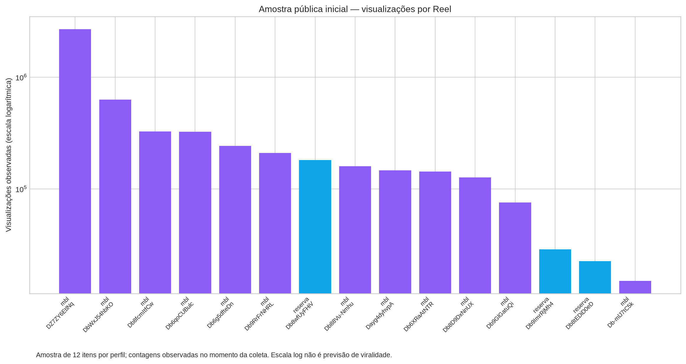

# Análise do catálogo público do Instagram

**Arquivo de origem:** `docs/instagram-api-catalog.csv`. A amostra contém **24 linhas normalizadas**, com contagens públicas observadas para os dois perfis [5].

> Esta versão distingue evidência observada de hipótese editorial. Ela não transforma curtidas ou visualizações em uma garantia de viralidade e não substitui a análise do vídeo individual.

## Métricas observadas

| Perfil | Amostra | Vídeos | Visualizações na amostra | Mediana de visualizações | Máximo | Engajamento médio por visualização | Formato predominante |
|---|---:|---:|---:|---:|---:|---:|---|
| `renansantosreserva` | 12 | 12 | 277803 | 5831 | 180609 | 18.02% | vertical_4x5 |
| `renansantosmbl` | 12 | 12 | 5087906 | 209292 | 2687788 | 24.83% | vertical_9x16 |

## Padrões editoriais preliminares

Na amostra disponível, os Reels combinam afirmação política direta, conflito com adversários ou instituições, reação a fatos noticiosos, humor/meme e chamadas para ação. Esses padrões foram observados nos itens públicos retornados pelos perfis [1] [2] e normalizados no catálogo local [5]. O perfil principal apresenta escala de visualizações muito superior à conta de reserva; por isso, o ranking do Furia Clips deve comparar cortes dentro de uma mesma live e normalizar sinais de audiência histórica, em vez de copiar limiares absolutos de um perfil para outro.

Os formatos observados variam entre 9:16, 4:5 e quadrado. Para o produto, isso sustenta um enquadramento seguro com prioridade a 9:16, preservando margem para rosto, legendas futuras e elementos de interface; o sistema deve registrar o formato original e não cortar automaticamente uma fala importante para preencher a tela.

A presença de legendas de publicação curtas, hashtags e CTAs sugere que o corte precisa entregar uma frase-âncora rapidamente, mas o catálogo não informa duração nem retenção. Consequentemente, a regra de seleção deve privilegiar contexto autossuficiente, progressão e payoff medidos na transcrição, deixando legenda visual e música como pós-produção.

## Itens de maior alcance observados

### `renansantosreserva`

| Reel | Visualizações | Curtidas | Comentários | Leitura editorial pública |
|---|---:|---:|---:|---|
| [Db8wfUyFHiV](https://www.instagram.com/p/Db8wfUyFHiV/) | 180,609 | 29,878 | 969 | Ué, será que esse jornalista mudou de ideia sobre o Renan Santos? 🤔  #Eleições2026 #Política #PartidoMissão #RenanSantos #eleições |
| [Db9ImrRjMh4](https://www.instagram.com/p/Db9ImrRjMh4/) | 28,707 | 4,228 | 44 | Por essa ninguém esperava! Renan Santos defendeu Mano Brown e falou a verdade sobre Oruam, que muita gente não tem coragem de admitir.  #RenanSantos #Política #PartidoMissão #Oruam |
| [Db8tEDiD0eD](https://www.instagram.com/p/Db8tEDiD0eD/) | 22,595 | 3,898 | 95 | Piada! O sistema está tentando esconder o que as redes sociais não escondem, Renan Santos está GIGANTE e crescendo cada vez mais.  #Eleições2026 #Política #PartidoMissão #RenanSant |
| [Db8-QOnCemH](https://www.instagram.com/p/Db8-QOnCemH/) | 13,793 | 2,621 | 28 | Ao ser questionado se acataria todas as decisões do STF em um eventual governo seu, Renan Santos disse: decisão ilegal não se cumpre!  #RenanSantos #Política #PartidoMissão #Eleiçõ |
| [Db9PagNj1QQ](https://www.instagram.com/p/Db9PagNj1QQ/) | 11,068 | 2,257 | 119 | Renan Santos afirma que o Brasil precisa ter sua própria Bomba Atômica e jornalistas ficam chocado!  #RenanSantos #Política #PartidoMissão #Eleições2026 #Direita |

### `renansantosmbl`

| Reel | Visualizações | Curtidas | Comentários | Leitura editorial pública |
|---|---:|---:|---:|---|
| [DZ7ZY6EtlNq](https://www.instagram.com/p/DZ7ZY6EtlNq/) | 2,687,788 | 456,503 | 12,409 | O que é o mundo por trás da propaganda do PT  Siga @renansantosmbl |
| [DbWxJ54hbKO](https://www.instagram.com/p/DbWxJ54hbKO/) | 630,418 | 126,394 | 8,642 | O PT destruiu minha vida 3 vezes.  Siga @renansantosmbl |
| [Db8fcmItfCw](https://www.instagram.com/p/Db8fcmItfCw/) | 326,665 | 67,680 | 3,007 | Veja como isso é bom!   Siga @renansantosmbl |
| [Db6qoCUBulc](https://www.instagram.com/p/Db6qoCUBulc/) | 324,954 | 40,661 | 747 | Nao deixa que a última risada seja a deles. Siga @renansantosmbl |
| [Db6g5dfteDn](https://www.instagram.com/p/Db6g5dfteDn/) | 242,299 | 50,893 | 1,562 | Decisão ilegal não se cumpre 👍🏻 Siga @renansantosmbl |

## Limitações e próximo nível de evidência

A coleta integral está sujeita ao limite público do Instagram: a primeira página é acessível, mas as requisições seguintes sofreram HTTP 429, comportamento compatível com as limitações de automação descritas na documentação do extrator e em referências técnicas recentes [3] [4]. A tentativa via gallery-dl também não localizou os perfis sem autenticação. O coletor foi deixado retomável e registra cada página bruta [6]. Para cumprir literalmente a análise audiovisual de todos os Reels, seria necessário acesso autenticado ou uma exportação autorizada dos dados/mídias, além de tempo e capacidade de análise proporcionais a milhares de vídeos.

A calibração do algoritmo nesta etapa deve ser tratada como **calibração inicial**, não como conclusão estatística. O próximo conjunto de dados prioritário é: duração, transcrição, início/fim do trecho, música/áudio, formato, presença de rosto e métricas de alcance por Reel. Com isso, será possível ajustar os gates de contexto e payoff com evidência audiovisual real.

## Referências

[1]: https://www.instagram.com/renansantosreserva/ — Perfil público @renansantosreserva.
[2]: https://www.instagram.com/renansantosmbl/ — Perfil público @renansantosmbl.
[3]: https://manpages.debian.org/unstable/gallery-dl/gallery-dl.conf.5.en.html — Documentação do gallery-dl 1.32.9.
[4]: https://scrapfly.io/blog/posts/how-to-scrape-instagram — Referência técnica recente sobre endpoints públicos e limites de automação.
[5]: ./instagram-api-catalog.csv — Catálogo normalizado salvo no repositório.
[6]: ./instagram-full-collection.log — Log local da coleta paginada e dos checkpoints.
